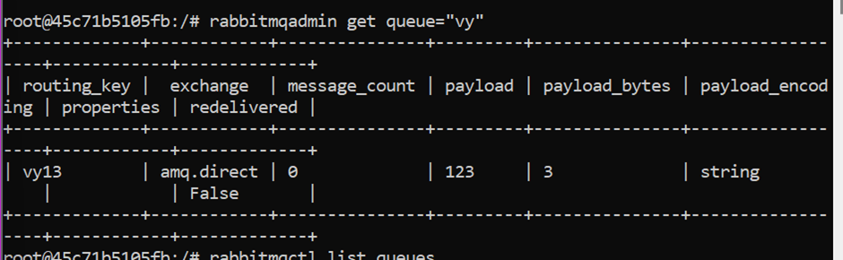

# Indexer

### Definition

Indexing is how Adobe Commerce and Magento Open Source transform data such as products and categories, to improve the performance of your **storefront(\*)**. As data changes, the transformed data must be updated or reindexed. The application has a very sophisticated architecture that stores lots of merchant data (including catalog data, prices, users, and stores) in many database tables. To optimize storefront performance, the application accumulates data into special tables using indexers

**storefront:** The online store that customers experience when they visit your Magento site.

### Indexing types

Each index can perform the following types of reindex operations:

* Full reindex, which means rebuilding all the indexing-related database tables. Full reindexing can be caused by a variety of things, including creating a new web store or new customer group. You can optionally fully reindex at any time using the [command line](manage-the-indexers.md).
* Partial reindex, which means rebuilding the database tables only for the things that changed (like changing a single product attribute or price)

The following figure shows the logic for partial reindexing.

<figure><figcaption></figcaption></figure>

### Indexing modes 

Reindexing can be performed in two modes:

* **Update on Save** - index tables are updated immediately after the dictionary data is changed.
* **Update by Schedule** - index tables are updated by cron job according to the configured schedule.

To set these options:

1. Log in to the [Admin](https://glossary.magento.com/magento-admin).
2. Click **System > Tools** **> Index Management**.
3. Select the checkbox next to each type of indexer to change.
4. From the **Actions** list, click the indexing mode.
5. Click **Submit**.

The following figure shows an example of setting indexers to Update by Schedule:

<figure><figcaption></figcaption></figure>

### How to reindex 

You can reindex by:

* Using a [cron job](https://experienceleague.adobe.com/docs/commerce-operations/configuration-guide/cli/configure-cron-jobs.html), which is preferred because indexing runs every minute.
* Using the [`magento indexer:reindex [indexer]`](https://experienceleague.adobe.com/docs/commerce-operations/configuration-guide/cli/manage-indexers.html#config-cli-subcommands-index-reindex) command, which reindexes selected indexers, or all indexers, one time only.

### Question ?

1. How indexing works in Magento
2. What exactly it does?
3. Why it is required?

**Flat Index**\
There are 2 such indexes. One for categories and one for products.\
By default the category and product entities (and customers and customer addresses but they are not important in this situation) are [EAV](http://en.wikipedia.org/wiki/Entity%E2%80%93attribute%E2%80%93value\_model) entities. This is very nice for extensibility. But it's a performance killer because in order to get all values for all the attributes you need a lot of joins or multiple queries.\
Here is where the flat indexer comes into play.\
It transforms the EAV structure into a flat structure. I mean it creates a table (one for each store view in Magento) that has one column corresponding to an attribute. This makes selects faster. For categories all attributes are converted to table columns. For products only the ones you mark as 'Used in product listing' because you can sell all types of products with different attributes and creating one table with a gazillion columns may not be possible.\
Also, some products may be disabled or may not belong to a certain website and there is no need to include them in the entries to search. They are excluded by the indexer.\
The generated flat tables are used for reading data in the fronend. The backend still uses the EAV structure.

**Catalog Search Index**\
You can search for products by many attribute values. Some of them may not be included in the flat tables generated by the flat indexer. This index fills in a table with the searchable attribute values for products so it's easier to look for them based on keywords. Having all the info in one table (or one field) makes it possible to use Full text search and get relevant results.

**Product Prices**.\
The price of a product can be affected by many variables. For example, customer group, website, catalog discount rules.\
Same as above, getting the products with their prices will mean a lot of joins or multiple selects. IN addition bundle products have a strange pricing system. This indexer aggregates the data in some tables (`catalog_product_index_price_*`) and makes the selects (sorting and filtering) much easier.

**Catalog url Rewrites**\
This cleans up the url rewrite rules by setting which url corresponds to which product or category. It's easier this way for the url management internal system to decide which page should you view when calling a non-standard url. Instead of searching through all the product and categories URL keys it just searches in one table.

**Category Products**\
In Magento you can set a category attribute named 'Is Anchor' to true or false. If it's true it means that the category in question will list all the products from it's child categories. Again, determining this realtime it will take more resources than just reading one table. This indexer creates the association between products and categories based on the associations you set in the backend and the 'Is Anchor' flag on the categories.

**Stock Status**\
For simple products it's easy. They can be in stock or out of stock, but for configurable, grouped and bundle is not that easy. They can be in stock or out of stock depending on the child products associated to the main product. Again (I'm just repeating my self here) getting their status real time would mean a lot of queries.

**Product Attributes**.\
This one collects all attributes that can be used in the layered navigation for same reason. Having all of them in one place for faster reading.

**Tag Aggregation**\
I have no idea what this does. I've never used tags in a real live project.
